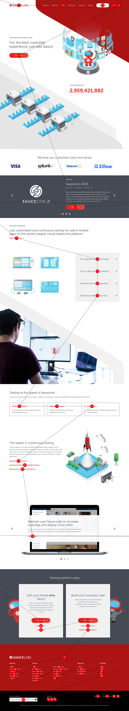
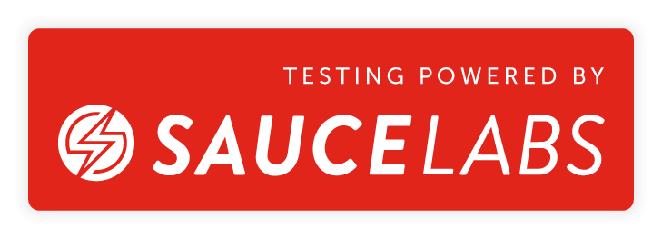

# wdio-image-comparison-service

[](https://gitter.im/wswebcreation/wdio-image-comparison-service "Gitter chat")

[](https://codecov.io/gh/wswebcreation/wdio-image-comparison-service)
[](https://app.eu-central-1.saucelabs.com/u/wdio-image-comparison-service)
[](https://nodei.co/npm/wdio-image-comparison-service/)

[](https://app.eu-central-1.saucelabs.com/u/wdio-image-comparison-service)

> **NOTE for Windows users!!<br/>**
> Please check the [FAQ](./README.md#faq)

## IMPORTANT!

1. This module will execute a **pixel-by-pixel** comparison for you. There are some things you can change during comparison, see [here](https://github.com/wswebcreation/webdriver-image-comparison/blob/master/docs/OPTIONS.md#plugin-options) but it stays a basic **pixel-by-pixel** comparison. <br/> This means that if for example Chrome updates to a newer version, you might need to change your baseline due to fontrendering differences.
1. Secondly you can only execute visual comparison on screenshots that have been taken with the same platform. For example, the screenshot on a Mac with Chrome can't be used to compare the same page on a Ubuntu or Windows with Chrome. <br/>**_You need to compare Apples with Apples, not Apples with Windows_**
1. Try to prevent accepting a `missmatch percentage`. You never know what you accept and especially with large screenshots you might accept a button not being rendered and or shown on a page.
1. **DONT' TRY TO MIMIC MOBILE SCREENSIZES BY RESIZING YOUR BROWSER AND SAY IT'S A CHROME OR SAFARI MOBILE BROWSER!!!!** This module is there to compare visuals of what you're user would see. A resized Chrome or Safari is not equal to what your enduser is using on his mobile phone. Web-pages and so on a desktop browser CAN'T be compared with mobile browsers due to different font, html and JS-rendering.
1. In my humble opinion it's useless to use this module with headless browsers and I will also NOT support any issues as a result of headless browsers. Reason is that an enduser is not using a headless browser :wink:

## What can it do?

_wdio-image-comparison-service_ is a lightweight _WebdriverIO_ service for browsers / mobile browsers / hybrid apps to do image comparison on screens, elements or full page screens.

You can:

-   save or compare screens / elements / full page screens against a baseline
-   automatically create a baseline when no baseline is there
-   blockout custom regions and even automatically exclude a status and or tool bars (mobile only) during a comparison
-   increase the element dimensions screenshots
-   use different comparison methods
-   **NEW:** We now support Puppeteer with WebdriverIO
-   **NEW:** You can now verify how your website will support tabbing with your keyboard, see also [here](./README.md#tabbing-through-a-website)
-   and much more, see the [options here](./docs/OPTIONS.md)

The module is now based on the power of the new [`webdriver-image-comparison`](https://github.com/wswebcreation/webdriver-image-comparison) module. This is a lightweight module to retrieve the needed data and screenshots for all browsers / devices.
The comparison power comes from [ResembleJS](https://github.com/Huddle/Resemble.js). If you want to compare images online you can check the [online tool](http://rsmbl.github.io/Resemble.js/)

It can be used for:

-   desktop browsers (Chrome / Firefox / Safari / Internet Explorer 11 / Microsoft Edge)
-   mobile / tablet browsers (Chrome / Safari on emulators / real devices) via Appium
-   Hybrid apps via Appium

> **NOTE for Hybrid!!<br/>**
> Please use the property `isHybridApp:true` in your service settings

## Installation

Install this module locally with the following command to be used as a (dev-)dependency:

```shell
npm install --save wdio-image-comparison-service
npm install --save-dev wdio-image-comparison-service
```

Instructions on how to install `WebdriverIO` can be found [here.](http://webdriver.io/guide/getstarted/install.html)

## Usage

> **_wdio-image-comparison-service_ supports NodeJS 8 or higher**

### Configuration

`wdio-image-comparison-service` is a service so it can be used as a normal service. You can set it up in your `wdio.conf.js` file with the following

```js
const { join } = require("path");
// wdio.conf.js
exports.config = {
    // ...
    // =====
    // Setup
    // =====
    services: [
        [
            "image-comparison",
            // The options
            {
                // Some options, see the docs for more
                baselineFolder: join(
                    process.cwd(),
                    "./tests/sauceLabsBaseline/"
                ),
                formatImageName: "{tag}-{logName}-{width}x{height}",
                screenshotPath: join(process.cwd(), ".tmp/"),
                savePerInstance: true,
                autoSaveBaseline: true,
                blockOutStatusBar: true,
                blockOutToolBar: true,
                // NOTE: When you are testing a hybrid app please use this setting
                isHybridApp: true,
                // Options for the tabbing image
                tabbableOptions: {
                    circle: {
                        size: 18,
                        fontSize: 18,
                        // ...
                    },
                    line: {
                        color: "#ff221a", // hex-code or for example words like `red|black|green`
                        width: 3,
                    },
                },
                // ... more options
            },
        ],
    ],
    // ...
};
```

More plugin options can be found [here](./docs/OPTIONS.md#plugin-options).

### Writing tests

_wdio-image-comparison-service_ is framework agnostic, meaning that you can use it with all the frameworks WebdriverIO supports like `Jasmine|Mocha`.
You can use it like this:

```js
describe("Example", () => {
    beforeEach(async () => {
        await browser.url("https://webdriver.io");
    });

    it("should save some screenshots", async() => {
        // Save a screen
        await browser.saveScreen("examplePaged", {
            /* some options */
        });

        // Save an element
        await browser.saveElement(await $("#element-id"), "firstButtonElement", {
            /* some options */
        });

        // Save a full page screenshot
        await browser.saveFullPageScreen("fullPage", {
            /* some options */
        });

        // Save a full page screenshot with all tab executions
        await browser.saveTabbablePage("save-tabbable", {
            /* some options, use the same options as for saveFullPageScreen */
        });
    });

    it("should compare successful with a baseline", async () => {
        // Check a screen
        await expect(
            await browser.checkScreen("examplePaged", {
                /* some options */
            })
        ).toEqual(0);

        // Check an element
        await expect(
            await browser.checkElement(await $("#element-id"), "firstButtonElement", {
                /* some options */
            })
        ).toEqual(0);

        // Check a full page screenshot
        await expect(
            await browser.checkFullPageScreen("fullPage", {
                /* some options */
            })
        ).toEqual(0);

        // Check a full page screenshot with all tab executions
        await expect(
            await browser.checkTabbablePage("check-tabbable", {
                /* some options, use the same options as for checkFullPageScreen */
            })
        ).toEqual(0);
    });
});
```

**If you run for the first time without having a baseline the `check`-methods will reject the promise with the following warning:**

```shell
#####################################################################################
 Baseline image not found, save the actual image manually to the baseline.
 The image can be found here:
 /Users/wswebcreation/Git/wdio-image-comparison-service/.tmp/actual/desktop_chrome/examplePage-chrome-latest-1366x768.png
 If you want the module to auto save a non existing image to the baseline you
 can provide 'autoSaveBaseline: true' to the options.
#####################################################################################

```

This means that the current screenshot is saved in the actual folder and you **manually need to copy it to your baseline**.
If you instantiate `wdio-image-comparison-service` with `autoSaveBaseline: true` the image will automatically be saved into the baseline folder.

### WebdriverIO MultiRemote

This module now also support MultiRemote. To make this work properly make sure that you add `'wdio-ics:options` to your
capabilities as can be seen below. This will make sure that each screenshot will have its own unique name.

```js
exports.config = {
    capabilities: {
        chromeBrowserOne: {
            capabilities: {
                browserName: "chrome",
                "goog:chromeOptions": {
                    args: ["disable-infobars", "--headless"],
                },
                // THIS!!!
                "wdio-ics:options": {
                    logName: "chrome-latest-one",
                },
            },
        },
        chromeBrowserTwo: {
            capabilities: {
                browserName: "chrome",
                "goog:chromeOptions": {
                    args: ["disable-infobars", "--headless"],
                },
                // THIS!!!
                "wdio-ics:options": {
                    logName: "chrome-latest-two",
                },
            },
        },
    },
};
```

### Running Programmatically

Here is a minimal example usage of getting `wdio-image-comparison-service` to work via `remote` options

```js
const { remote } = require("webdriverio");

const WdioImageComparisonService =
    require("wdio-image-comparison-service").default;

let wdioImageComparisonService = new WdioImageComparisonService({});

async function main() {
    const browser = await remote({
        logLevel: "silent",
        capabilities: {
            browserName: "chrome",
        },
    });

    global.browser = browser;

    wdioImageComparisonService.defaultOptions.autoSaveBaseline = true;
    browser.defaultOptions = wdioImageComparisonService.defaultOptions;
    browser.folders = wdioImageComparisonService.folders;

    wdioImageComparisonService.before(browser.capabilities);

    await browser.url("https://webdriver.io/");

    // or use this for ONLY saving a screenshot
    await browser.saveFullPageScreen("examplePaged", {});

    // or use this for validating. Both methods don't need to be combined, see the FAQ
    await browser.checkFullPageScreen("examplePaged", {});

    await browser.deleteSession();
}

main().catch(async (e) => {
    console.error(e);
});
```

### Test result outputs

The `save(Screen/Element/FullPageScreen)` methods will provide the following information after the method has been executed:

```js
const saveResult = {
    // The device pixel ratio of the instance that has run
    devicePixelRatio: 1,
    // The formatted filename, this depends on the options `formatImageName`
    fileName: "examplePage-chrome-latest-1366x768.png",
    // The path where the actual screenshot file can be found
    path: "/Users/wswebcreation/Git/wdio-image-comparison-service/.tmp/actual/desktop_chrome",
};
```

See the [Save output](./docs/OUTPUT.md#save-output) section in the [output](./docs/OUTPUT.md) docs for the images.

By default the `check(Screen/Element/FullPageScreen)` methods will only provide a mismatch percentage like `1.23`, but when the plugin has the options `returnAllCompareData: true` the following information is provided after the method has been executed:

```js
const checkResult = {
    // The formatted filename, this depends on the options `formatImageName`
    fileName: "examplePage-chrome-headless-latest-1366x768.png",
    folders: {
        // The actual folder and the file name
        actual: "/Users/wswebcreation/Git/wdio-image-comparison-service/.tmp/actual/desktop_chrome/examplePage-chrome-headless-latest-1366x768.png",
        // The baseline folder and the file name
        baseline:
            "/Users/wswebcreation/Git/wdio-image-comparison-service/localBaseline/desktop_chrome/examplePage-chrome-headless-latest-1366x768.png",
        // This following folder is optional and only if there is a mismatch
        // The folder that holds the diffs and the file name
        diff: "/Users/wswebcreation/Git/wdio-image-comparison-service/.tmp/diff/desktop_chrome/examplePage-chrome-headless-latest-1366x768.png",
    },
    // The mismatch percentage
    misMatchPercentage: 2.34,
};
```

See the [Check output on failure](./docs/OUTPUT.md#check-output-on-failure) section in the [output](./docs/OUTPUT.md) docs for the images.

### Tabbing through a website

We now support checking if a website is accessible through using the keyboards `TAB`-key. Testing this part of accessibility has always been a time consuming (manual) job and pretty hard to do through automation.
With the methods `saveTabbablePage` and `checkTabbablePage` you can now draw lines and dots on your website to verify the tabbing order.

Be aware of the fact that this is only useful for desktop browser and **NOT** for mobile devices. All desktop browsers are supporting this feature, see the browser matrix on the top of this page to check which desktop browsers and versions are supported.

> **NOTE:**<br>
> The work is inspired by [Viv Richards](https://github.com/vivrichards600) his blog post about ["AUTOMATING PAGE TABABILITY (IS THAT A WORD?) WITH VISUAL TESTING"](https://vivrichards.co.uk/accessibility/automating-page-tab-flows-using-visual-testing-and-javascript).<br>
> The way tabbable elements are selected are based on the module [tabbable](https://github.com/davidtheclark/tabbable). If there are any issues regarding the tabbing please check the [README.md](https://github.com/davidtheclark/tabbable/blob/master/README.md) and especially the [More details](https://github.com/davidtheclark/tabbable/blob/master/README.md#more-details)-section.

#### How does it work

Both methods will create a `canvas` element on your website and draw lines and dots to show you where your TAB would go if an end-user would use it. After that it will create a full page screenshot to give you a good overview of the flow.

> **Use the `saveTabbablePage` only when you need to create a screenshot and DON'T want to compare it with a base line image.**

When you want to compare the tabbing flow with a baseline, then you can use the `checkTabbablePage`-method. You **DON'T** need to use the two methods together. If there is already a baseline image created, which can automatically be done by providing `autoSaveBaseline: true` when you instantiate the service,
the `checkTabbablePage` will first create the _actual_ image and then compare it against the baseline.

##### Options

Both methods use the same options as the [`saveFullPageScreen`](https://github.com/wswebcreation/webdriver-image-comparison/blob/master/docs/OPTIONS.md#savefullpagescreen-or-savetabbablepage) or the
[`compareFullPageScreen`](https://github.com/wswebcreation/webdriver-image-comparison/blob/master/docs/OPTIONS.md#comparefullpagescreen-or-comparetabbablepage).

#### Example

This is an example of how the tabbing works on the website of our amazing sponsor [Sauce Labs](https://www.saucelabs.com):



### DEV-TOOLS support

You can also use the Chrome DevTools as automation protocol in combination with this module. You don't need to do anything,
just change `automationProtocol: 'devtools'` in your config.
More information about how to use the DEV-TOOLS can be found in [this](https://webdriver.io/blog/2019/09/16/devtools.html) blog post.

### Typescript support

We now also support typescript types. Add the following to the `types` in your `tsconfig.json`:

```json
{
    "compilerOptions": {
        "types": ["wdio-image-comparison-service"]
    }
}
```

## FAQ

### Do I need to use a `save(Screen/Element/FullPageScreen)` methods when I want to run `check(Screen/Element/FullPageScreen)`?

No, you don't need to do this. The `check(Screen/Element/FullPageScreen)` will do this automatically for you

### Width and height cannot be negative

It could be that the error `Width and height cannot be negative` is thrown. 9 out of 10 times this is related to creating an image of an element that is not in the view. Please be sure you always make sure the element in is in the view before you try to make an image of the element.

### Installation of Canvas on Windows failed with Node-Gyp logs

Canvas uses Node-Gyp and might cause some issues on Windows that are not fully set up. Please check [this post](https://spin.atomicobject.com/2019/03/27/node-gyp-windows/) for Fixing Node-Gyp Issues on Windows. (Thanks to [IgorSasovets](https://github.com/IgorSasovets))

## Contribution

See [CONTRIBUTING.md](./docs/CONTRIBUTING.md).

## TODO:

-   [ ] fix the scroll-bar for Android, sometimes it shows
-   [ ] create a new website

## Credits

`wdio-image-comparison-service` uses an open source licence from Sauce Labs.


You can request your open source licence [here](https://saucelabs.com/open-source/open-sauce)
